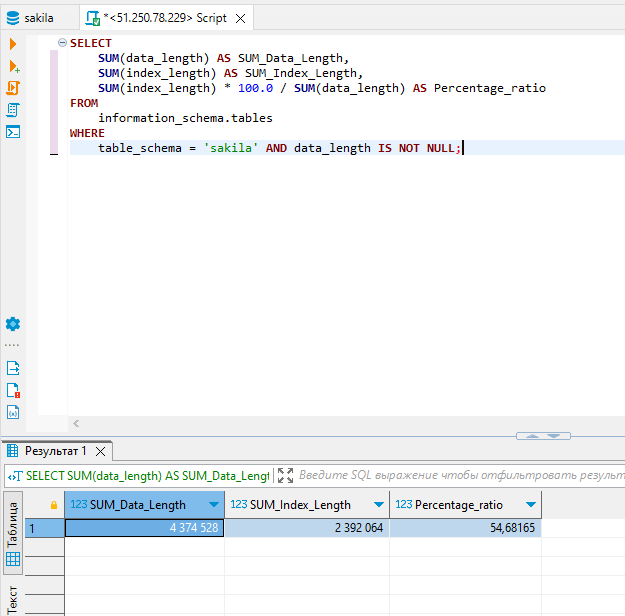
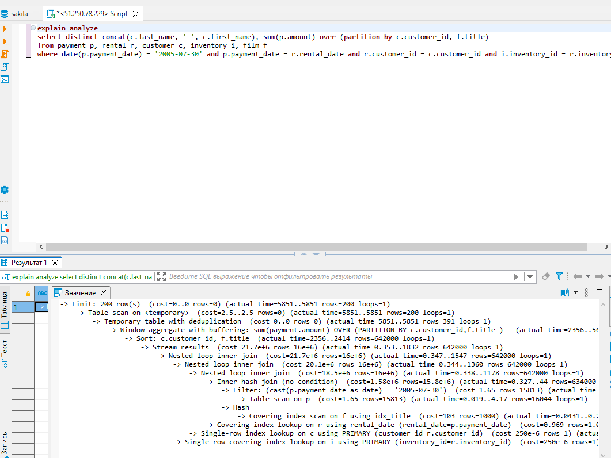
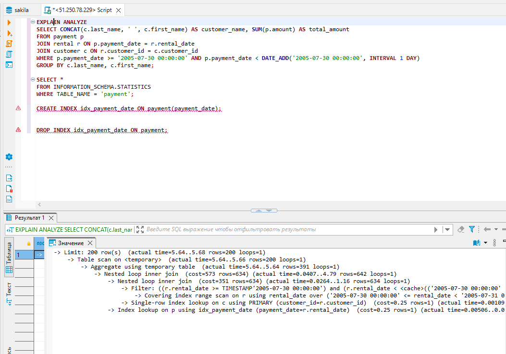

# Домашнее задание к занятию «Индексы»

### Инструкция по выполнению домашнего задания

1. Сделайте fork [репозитория c шаблоном решения](https://github.com/netology-code/sys-pattern-homework) к себе в Github и переименуйте его по названию или номеру занятия, например, https://github.com/имя-вашего-репозитория/gitlab-hw или https://github.com/имя-вашего-репозитория/8-03-hw).
2. Выполните клонирование этого репозитория к себе на ПК с помощью команды `git clone`.
3. Выполните домашнее задание и заполните у себя локально этот файл README.md:
   - впишите вверху название занятия и ваши фамилию и имя;
   - в каждом задании добавьте решение в требуемом виде: текст/код/скриншоты/ссылка;
   - для корректного добавления скриншотов воспользуйтесь инструкцией [«Как вставить скриншот в шаблон с решением»](https://github.com/netology-code/sys-pattern-homework/blob/main/screen-instruction.md);
   - при оформлении используйте возможности языка разметки md. Коротко об этом можно посмотреть в [инструкции по MarkDown](https://github.com/netology-code/sys-pattern-homework/blob/main/md-instruction.md).
4. После завершения работы над домашним заданием сделайте коммит (`git commit -m "comment"`) и отправьте его на Github (`git push origin`).
5. Для проверки домашнего задания преподавателем в личном кабинете прикрепите и отправьте ссылку на решение в виде md-файла в вашем Github.
6. Любые вопросы задавайте в чате учебной группы и/или в разделе «Вопросы по заданию» в личном кабинете.

Желаем успехов в выполнении домашнего задания.

### Задание 1

Напишите запрос к учебной базе данных, который вернёт процентное отношение общего размера всех индексов к общему размеру всех таблиц.

### Ответ:

```
SELECT 
    SUM(data_length) AS SUM_Data_Length,
    SUM(index_length) AS SUM_Index_Length,
    SUM(index_length) * 100.0 / SUM(data_length) AS Percentage_ratio
FROM 
    information_schema.tables
WHERE 
    table_schema = 'sakila' AND data_length IS NOT NULL;
```



### Задание 2

Выполните explain analyze следующего запроса:
```sql
select distinct concat(c.last_name, ' ', c.first_name), sum(p.amount) over (partition by c.customer_id, f.title)
from payment p, rental r, customer c, inventory i, film f
where date(p.payment_date) = '2005-07-30' and p.payment_date = r.rental_date and r.customer_id = c.customer_id and i.inventory_id = r.inventory_id
```
- перечислите узкие места;
- оптимизируйте запрос: внесите корректировки по использованию операторов, при необходимости добавьте индексы.

### Узкие места и их устранение

1. Запрос слишком сложный и в нём используются избыточные таблицы. Из запроса убираем фрагмент over (partition by c.customer_id, f.title) и оператор distinct. Так же убираем избыточные таблицы film и inventory :

```
select concat(c.last_name, ' ', c.first_name), sum(p.amount)
from payment p, rental r, customer c
where date(p.payment_date) = '2005-07-30' and p.payment_date = r.rental_date and r.customer_id = c.customer_id
group by c.last_name, c.first_name;
```

Время выполнения запроса сокращается более чем в 60 раз.

2. Можно выполнить объединение таблиц в запросе, использую оператор join :

```
select concat(c.last_name, ' ', c.first_name), sum(p.amount)
from customer c
join rental r on r.customer_id = c.customer_id
join payment p on p.payment_date = r.rental_date a
```
3. Для таблицы payment на столбец payment_date можно создать индекс : Смотрим существующие для таблицы индексы и создаём новый индекс:

```
SELECT CONCAT(c.last_name, ' ', c.first_name) AS customer_name, SUM(p.amount) AS total_amount
FROM payment p
JOIN rental r ON p.payment_date = r.rental_date
JOIN customer c ON r.customer_id = c.customer_id
WHERE p.payment_date >= '2005-07-30 00:00:00' AND p.payment_date < DATE_ADD('2005-07-30 00:00:00', INTERVAL 1 DAY)
GROUP BY c.last_name, c.first_name;

CREATE INDEX idx_payment_date ON payment(payment_date);

SELECT *
FROM INFORMATION_SCHEMA.STATISTICS
WHERE TABLE_NAME = 'payment';

DROP INDEX idx_payment_date ON payment;
```

### Скриншот анализа запроса без индекса



### Скриншот анализа запроса с индексом




## Дополнительные задания (со звёздочкой*)
Эти задания дополнительные, то есть не обязательные к выполнению, и никак не повлияют на получение вами зачёта по этому домашнему заданию. Вы можете их выполнить, если хотите глубже шире разобраться в материале.

### Задание 3*

Самостоятельно изучите, какие типы индексов используются в PostgreSQL. Перечислите те индексы, которые используются в PostgreSQL, а в MySQL — нет.

*Приведите ответ в свободной форме.*

### Ответ:

В PostgreSQL и MySQL существуют различные типы индексов. Вот некоторые типы индексов, которые используются в PostgreSQL, но не поддерживаются в MySQL:

1. GIN (Generalized Inverted Index): Индекс, предназначенный для полнотекстового поиска и поиска по массивам или JSON-данным.
2. GiST (Generalized Search Tree): Индекс, который позволяет создавать пользовательские типы данных и определять пользовательские операторы поиска.
3. BRIN (Block Range Index): Индекс, который разделяет таблицу на блоки и хранит суммарную информацию о каждом блоке. BRIN-индексы хорошо подходят для больших таблиц с упорядоченными данными.
4. SP-GiST (Space-Partitioned Generalized Search Tree): Индекс, предназначенный для индексации географических данных и других сложных типов данных.
5. Hash Index: Индекс, использующий хэш-функцию для быстрого поиска. В PostgreSQL хэш-индексы могут использоваться только для равенства (=) операций, в отличие от B-деревьев, которые поддерживают диапазонные операции.
6. Partial Index: Индекс, создаваемый на подмножестве строк таблицы, удовлетворяющих определенному условию. Partial индексы позволяют сократить размер индекса и улучшить производительность запросов.
7. Expression Index: Индекс, создаваемый на выражении или функции от столбцов таблицы. Expression индексы позволяют создавать индексы на вычисляемых значениях.

Это лишь некоторые из типов индексов, которые доступны в PostgreSQL, но не поддерживаются в MySQL. Обе СУБД имеют также общие типы индексов, такие как B-дерево (B-Tree) и индекс на уникальное значение (Unique Index).
